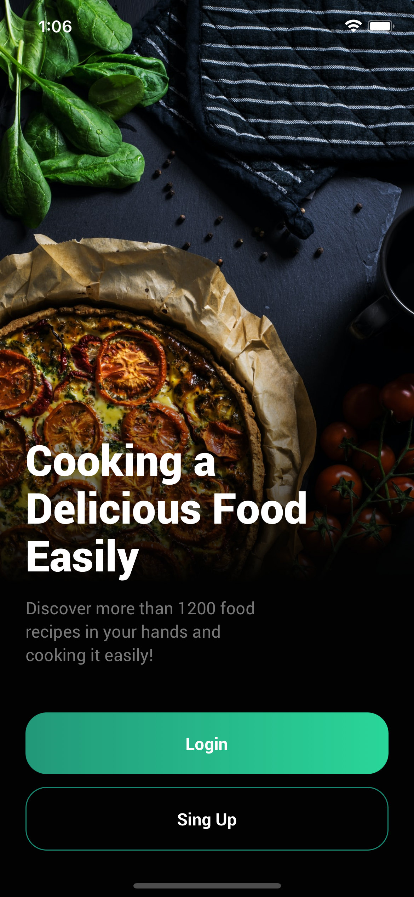
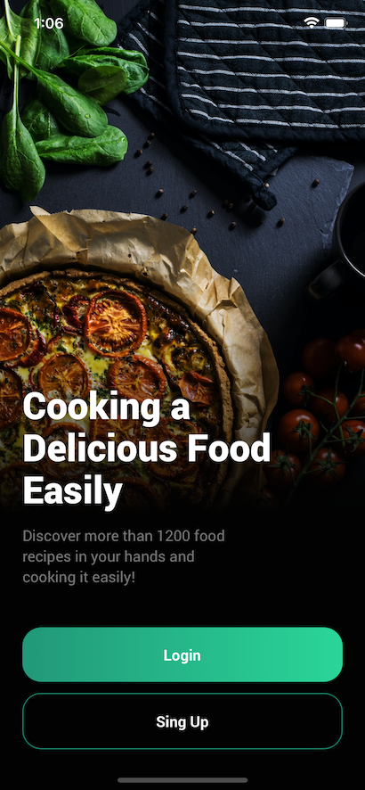

# Recipes App

> react native food recipe app

[](https://cdn.dribbble.com/users/1294892/screenshots/15295362/media/a8c454a69e3f3a51e6b85842d7dbbe50.png?compress=1&resize=1600x1200)

###### Desing by [Herdetya Priambodo](https://dribbble.com/herdetya)


## Screenshots
----
<!-- 
 -->
##### Login Screen

<!-- 
 -->

## Features

- Login
- Home recipes feed
- Recipes details

## Next steps

- User authentication
- Create home screens

## Build Setup

```bash
# install dependencies
yarn install

#  install the pods (via Cocoapods) to complete the linking
npx pod-install ios

# run on ios
npx react-native run-ios
```
