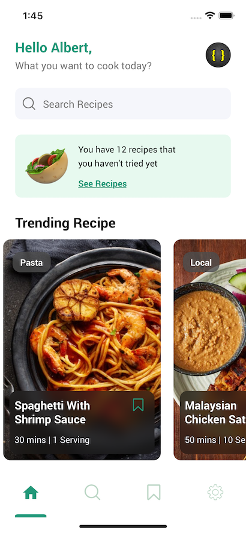

# Recipes App

> react native food recipe app

[](https://cdn.dribbble.com/users/1294892/screenshots/15295362/media/a8c454a69e3f3a51e6b85842d7dbbe50.png?compress=1&resize=1600x1200)

###### Design by [Herdetya Priambodo](https://dribbble.com/herdetya)

## Screenshots
---
#### Login Screen

---
#### Home Screen

---
#### Recipe Details Screen


#### Header Animation


----

## Features

- Login
- Home recipes feed
- Recipes details
  - Header Animation

## Next steps
- Refactor Screen Components
- User authentication(context)
- Search Component

## Build Setup

```bash
# install dependencies
yarn install

#  install the pods (via Cocoapods) to complete the linking
npx pod-install ios

# run on ios
npx react-native run-ios
```
